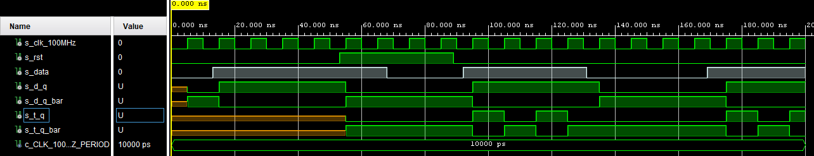
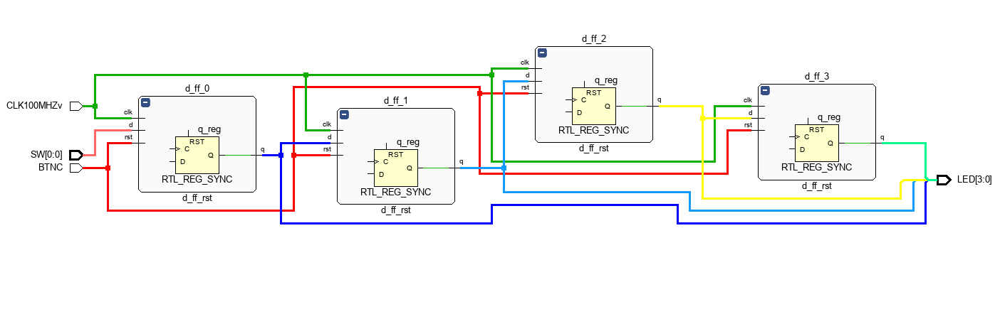

# Lab 5: YOUR_FIRSTNAME LASTNAME

### Flip-flops

1. Listing of VHDL architecture for T-type flip-flop. Always use syntax highlighting, meaningful comments, and follow VHDL guidelines:

```vhdl
architecture Behavioral of t_ff_rst is
    -- It must use this local signal instead of output ports
    -- because "out" ports cannot be read within the architecture
    signal s_q : std_logic;
begin
    --------------------------------------------------------
    -- p_t_ff_rst:
    -- T type flip-flop with a high-active synchro reset,
    -- rising-edge clk.
    -- q(n+1) = t./q(n) + /t.q(n)
    -- q(n+1) =  q(n) if t = 0 (no change)
    -- q(n+1) = /q(n) if t = 1 (inversion)
    --------------------------------------------------------
    p_t_ff_rst : process(clk)
    begin
         if rising_edge(clk) then
            if (rst = '1') then
                s_q <= '0';
            else
            -- normal function
                if t = '0' then
                  -- no change
                  s_q <=  s_q; 
                else  
                    -- inversion
                   s_q <= not s_q; 
                end if;     
            end if;      
        end if;
    end process p_t_ff_rst;

    -- Output ports are permanently connected to local signal
    q     <= s_q;
    q_bar <= not s_q;
end architecture Behavioral;
```

2. Screenshot with simulated time waveforms. Try to simulate both flip-flops in a single testbench with a maximum duration of 200 ns, including reset. Always display all inputs and outputs (display the inputs at the top of the image, the outputs below them) at the appropriate time scale!

   

### Shift register

1. Image of the shift register `top` level schematic. The image can be drawn on a computer or by hand. Always name all inputs, outputs, components and internal signals!

Schéma:
   
   
Kód:
```vhdl
library IEEE;
use IEEE.STD_LOGIC_1164.ALL;

entity top is
    Port ( CLK100MHZv : in STD_LOGIC;
           BTNC : in STD_LOGIC;
           SW : in STD_LOGIC_VECTOR (1-1 downto 0);
           LED : out STD_LOGIC_VECTOR (3 downto 0));
end top;
------------------------------------------------------------------------
-- Architecture body for top level
------------------------------------------------------------------------
architecture Behavioral of top is

  -- Internal signals between flip-flops
  signal s_ff0 : std_logic;
  -- WRITE YOUR CODE HERE
  signal s_ff1 : std_logic;
  signal s_ff2 : std_logic;
  signal s_ff3 : std_logic;

begin

  --------------------------------------------------------------------
  -- Four instances (copies) of D-type FF entity
   d_ff_0 : entity work.d_ff_rst
      port map(
          clk   => CLK100MHZv,
          rst   => BTNC,
          -- WRITE YOUR CODE HERE
          q     => s_ff0,
          d     => SW(0)
      );
     LED(0) <= '1' when (s_ff0 ='1') 
                   else '0';
     
     d_ff_1 : entity work.d_ff_rst
      port map(
          clk   => CLK100MHZv,
          rst   => BTNC,
          -- WRITE YOUR CODE HERE
          q     => s_ff1,
          d     => s_ff0
      );
     LED(1) <= '1' when (s_ff1 ='1') 
                   else '0';

  -- PUT OTHER TWO FLIP-FLOP INSTANCES HERE
    d_ff_2 : entity work.d_ff_rst
      port map(
          clk   => CLK100MHZv,
          rst   => BTNC,
          -- WRITE YOUR CODE HERE
          q     => s_ff2,
          d     => s_ff1
      );
     LED(2) <= '1' when (s_ff2 ='1') 
                   else '0';
                    
    d_ff_3 : entity work.d_ff_rst
      port map(
          clk   => CLK100MHZv,
          rst   => BTNC,
          -- WRITE YOUR CODE HERE
          q     => s_ff3,
          d     => s_ff2
      );
     LED(3) <= '1' when (s_ff3 ='1') 
                   else '0';                
                                        
end architecture Behavioral;
```
