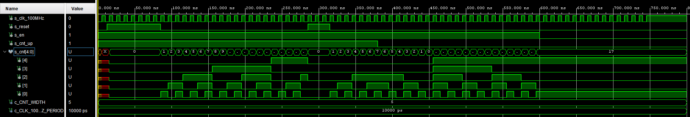
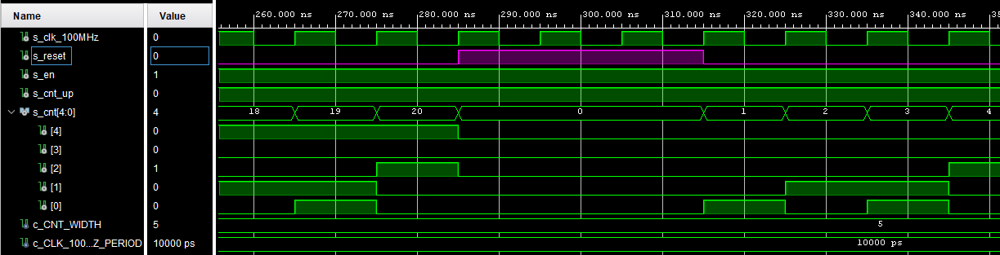
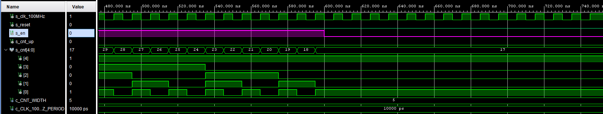
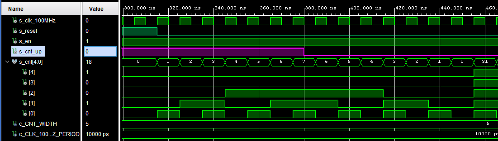
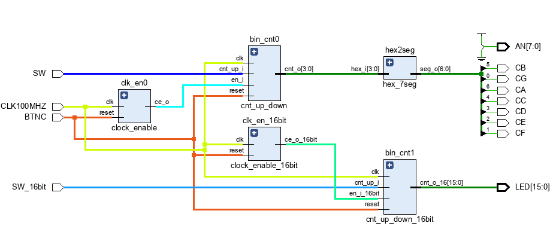

# Lab 6: Bidirectional counter

1. Listing of VHDL code of the completed process `p_cnt_up_down`. Always use syntax highlighting, meaningful comments, and follow VHDL guidelines:

```vhdl
    --------------------------------------------------------
    -- p_cnt_up_down:
    -- Clocked process with synchronous reset which implements
    -- n-bit up/down counter.
    --------------------------------------------------------
    p_cnt_up_down : process(clk)
    begin
        if rising_edge(clk) then
        
            if (reset = '1') then   -- Synchronous reset
                s_cnt_local <= (others => '0'); -- Clear all bits

            elsif (en_i = '1') then -- Test if counter is enabled
               -- TEST COUNTER DIRECTION HERE
                if (cnt_up_i = '1') then
                    s_cnt_local <= s_cnt_local + 1;
                else 
                    s_cnt_local <= s_cnt_local - 1;  
                end if;     
            
            end if;
        end if;
    end process p_cnt_up_down;
```

2. Screenshot with simulated time waveforms. Test reset as well. Always display all inputs and outputs (display the inputs at the top of the image, the outputs below them) at the appropriate time scale!
 - Simulated time waveforms:
 

- Change of parameter `s_reset` 


- Change of parameter `s_en` 


- Change of parameter `s_cnt_up` 

### Two counters

1. Image of the top layer structure including both counters, ie a 4-bit bidirectional counter from *Part 4* and a 16-bit counter with a 10 ms time base:

   
   
Different time base changed in `tb_cnt_up_down_16bit`:
```vhdl
architecture testbench of tb_cnt_up_down_16bit is

    -- Number of bits for testbench counter
    constant c_CNT_WIDTH         : natural := 16;
    constant c_CLK_100MHZ_PERIOD : time    := 10 ms;

    --Local signals
    signal s_clk_100MHz : std_logic;
    signal s_reset      : std_logic;
    signal s_en_16bit        : std_logic;
    signal s_cnt_up     : std_logic;
    signal s_cnt_16        : std_logic_vector(c_CNT_WIDTH - 1 downto 0);
```
